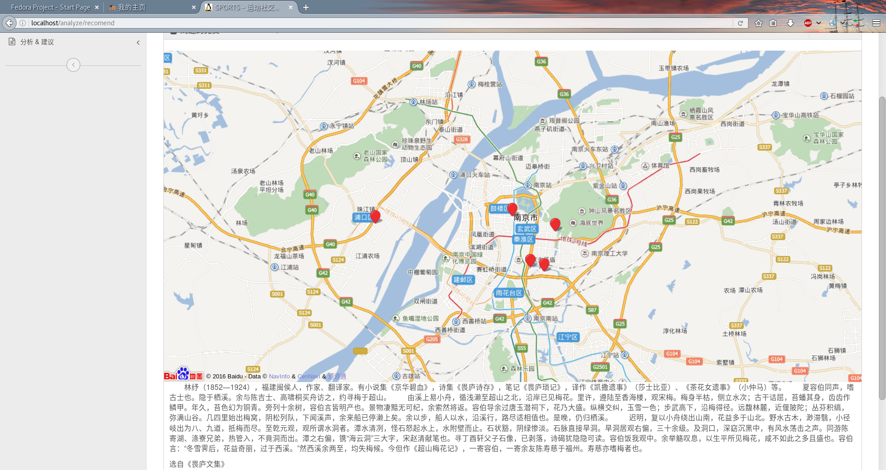
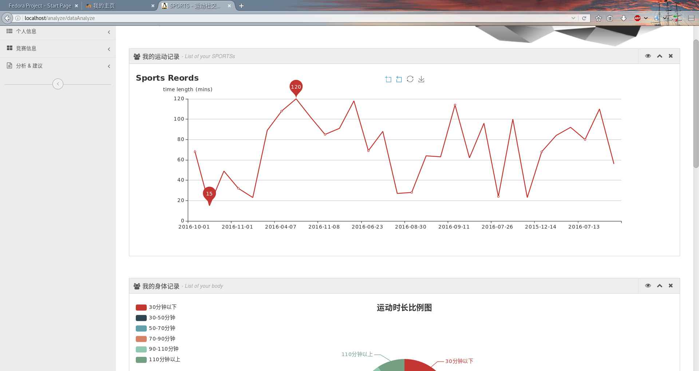
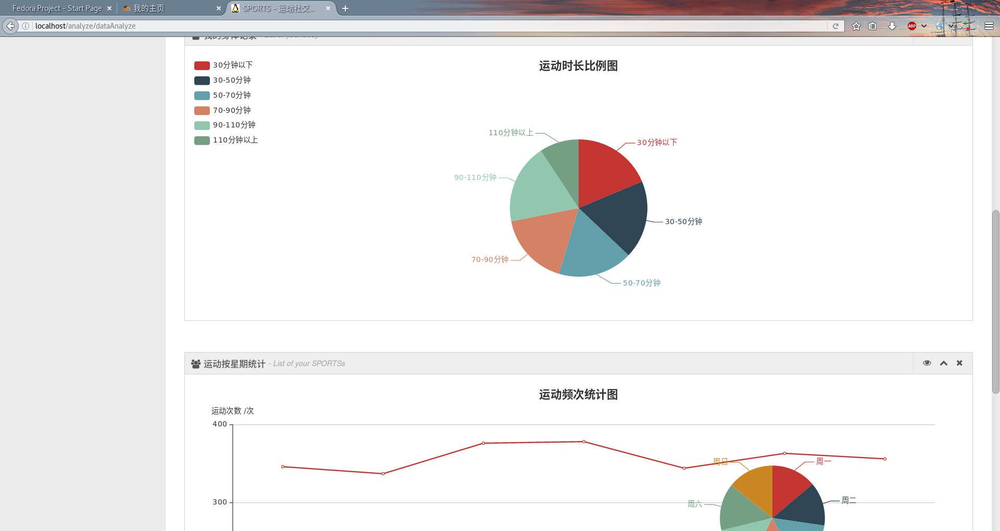
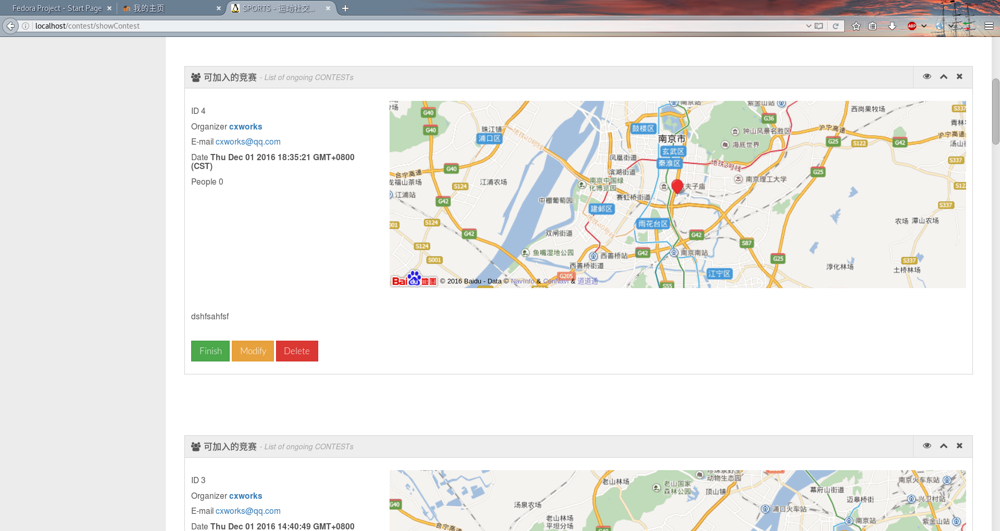
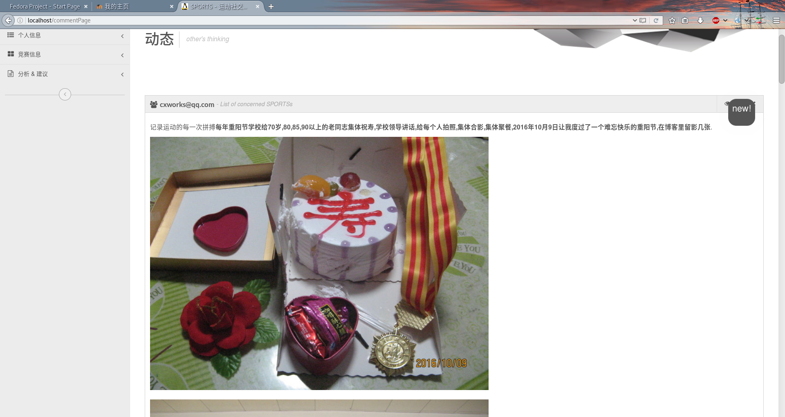
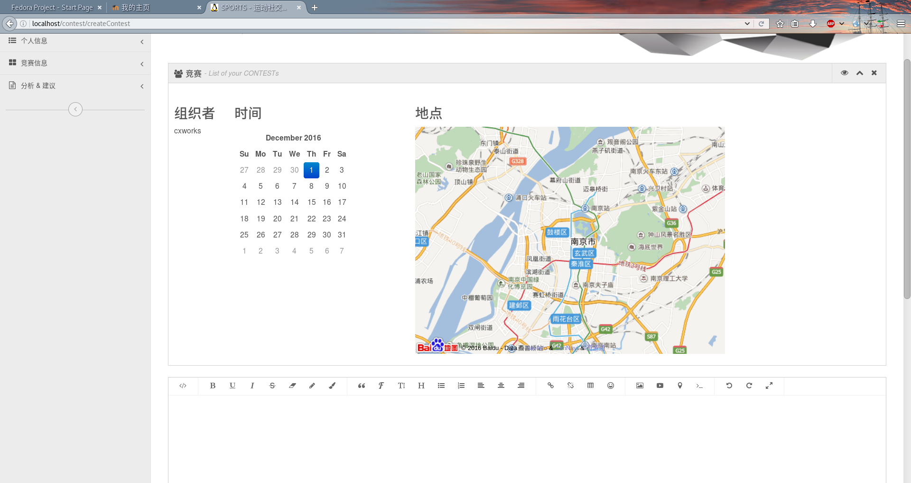

# SPORTS
一个健康社交的web应用
=======
* 一个健康社交的web应用
* 南京大学软件学院《面向web的计算》大作业

## 部署方法

* 建议使用xampp建站包，将Apache跟目录改到laravel/public,设置rewrite on
* php>=5.6
* 采用sqlite3作为数据库，不过可以自行选用数据库，请自行配置.env文件
* 安装了插件[intervention/image](http://image.intervention.io/),请利用下面命令安装

        composer require intervention/image
* 请配置smtp邮件服务，否则重置密码无法工作 

## 实现的功能

1. 运动管理：个人运动数据的收集，显示等。基于restful的方式注入数据，模拟可穿戴设备的数据采集，模拟测试数据集不少于5千条，数据格式参考类似设备定义（xml格式），并在设计文档中给出详细说明。
2. 活动管理：发布、修改、删除、参与等。类似参考网站的竞赛，简版。
3. 用户管理：账户设置，好友管理等。
4. 权限管理：自行设计，设计可复杂，实现可简化，例如：个人用户、系统管理员。个人用户可进阶，不同等级用户可有不同功能权限。
5. 统计分析：对历史数据的统计分析展示。
6. 社交：自行设计，设计可复杂，实现可简化，例如粉丝、圈子。
7. 整合百度地图API的定位功能

## 使用的技术

1.	html5+css3
2.	跨浏览器兼容性
3.	语义化
4.	SEO
5.	分众分类
6.	css sprite
7.	响应式web设计
8.	js闭包
9.	正则表达式
10.	设计模式的应用

## 技术实现运用

- 采用jquery+bootstrap作为前端框架
- [wangEditor](https://github.com/wangfupeng1988/wangEditor)作为富文本编辑器并配置上传图片
- 百度地图API
- 后端laravel框架完整应用
- restful controller
- 数据seeder与[faker](https://github.com/fzaninotto/Faker)

## 运行截图

>定位与竞赛信息展示 

>运动日期统计 

>运动时长、频次统计 

>竞赛信息展示、管理 

>发布动态信息 

>发布竞赛信息 

